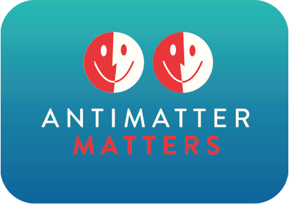

# Outreach (Terza missione)
In science, Outreach refers to activities that engage the public, educators, and students to communicate scientific knowledge, promote awareness, and inspire interest in research and discovery. You can find here my activities.

---

## [Lab2go](https://web.infn.it/lab2go/)
- Dates: from 2022 - present
- Target: Secondary schools
- Role: Representative for INFN Milano

The PCTO – LAB2GO project, founded by INFN and Sapienza University in Rome, aims to enhance the value of existing local laboratories and museums in secondary schools. 

read more...

In Milan, activities are carried out in > 40 high schools in the city (e.g. Liceo Donatelli-Pascal, Piero Bottoni, etc.).
The project targets upper secondary schools nationwide with the following objectives:  
- Enhancing the existing educational heritage in secondary schools.  
- Promoting laboratory-based teaching in schools and sharing best teaching practices through the creation of materials and events open to the school community and/or a broader audience.  
- Training teachers in laboratory-based teaching practices.
The activities take place within the school facilities in collaboration with class teachers and are carried out over multiple afternoon lab sessions throughout the year. This lab work can then serve as input for preparing materials for the final-year state exam.

---

## [Progetto Nuvoletta](https://nuvoletta.mi.infn.it/)
- Dates: from 2022 - present
- Target: General audience
- Author

The project involves the design and construction of a portable cloud chamber for outreach activities. The goal is to develop a fully functional, cost-effective instrument that can potentially be acquired by schools and institutions for their educational activities.

---

## [European Researchers’ Night](https://collisioni.infn.it/evento/linfn-alla-notte-europea-delle-ricercatrici-e-dei-ricercatori-2023/)
- Dates: from 2021 - present
- Target: General audience

I am involved in the organization of the INFN stand for the **European Researchers’ Night**, which takes place in Milan at the Museum of Science and Technology (yearly). I also serve as a guide for the exhibition **Extreme** on particle physics.

---

## [Antimatter Matters (Summer Science Exhibition 2016)](https://www.facebook.com/Antimatter2016/)
- Dates: 4th July - 10th july 2016
- Location: Royal Society, London
- Audience: 10k+ persons
 
I designed several mock-up experiments on CP violation and how to explain it to a general non-specialistic audience.
This stand has been touring the UK for several national science festivals.

---

## [CERN and LHCb official guide](https://visit.cern/guided-tours)
From 2013, I am a trained guide for official visits at CERN and the LHCb experiment.

