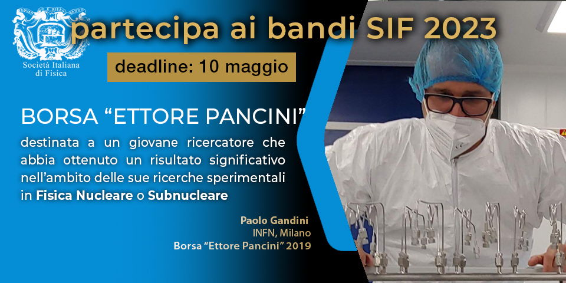
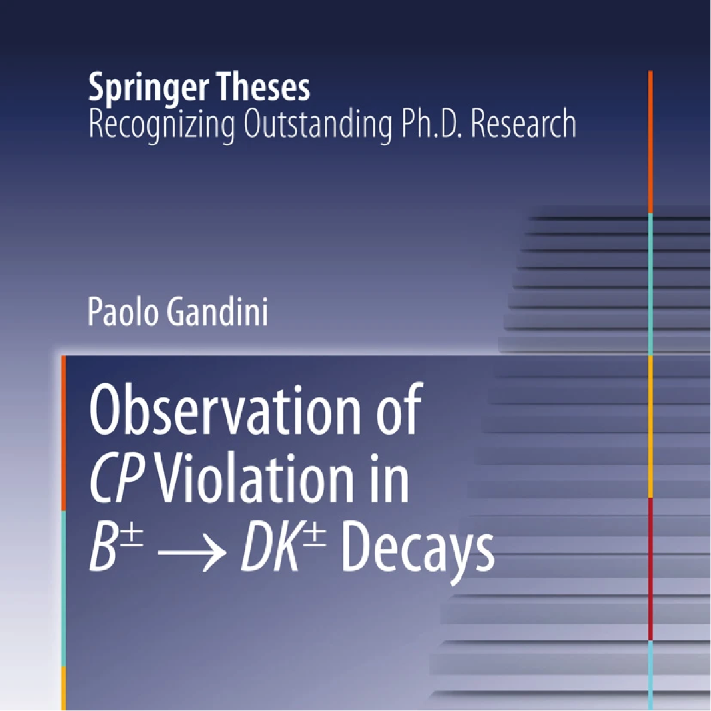

---

# Ettore Pancini prize
- September 2019
- Italian Physics Society (SIF)
- Young scientist below 35y

Awarded to an early-career physics researcher under the age of 35 for achieving a significant breakthrough in experimental Nuclear or Subnuclear Physics.

**Official award mention: Paolo Gandini, graduate of the University of Milan, PhD at the University of Oxford, currently a researcher at INFN, Milan Section, for his decisive contribution to the activities of the LHCb experiment at CERN, with particular focus on spectroscopy measurements and CP violation.**

---

# Springer Thesis Prize
- March 2013
- Springer Theses - the best of the best
- ISBN 978-3-319-01029-8

Thesis nominated as an outstanding PhD thesis by the University of Oxford and published in the
**Springer Theses - the best of the best** series.

---

# JT Hamilton Scholarship in Physics
- Years 2009-2012
Scholarship in Physics at Balliol College, Oxford.
