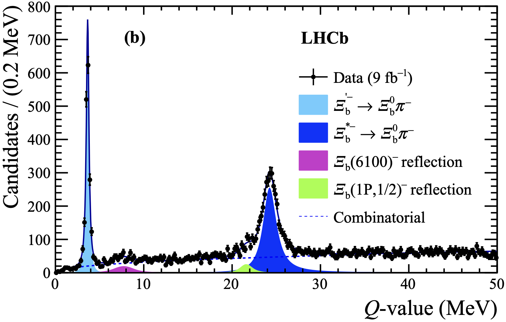

# Research Interests
Below are my key research interests, ranging from data analysis to software and hardware development for high-energy physics.

---

### Data Analysis - Spectroscopy of new states at LHCb
In recent years, I have led several analyses focused on searching for both conventional and exotic particle states.

read more...

My primary research has centered on heavy baryons, an area that was largely unexplored before the LHC era. Since then, the LHCb experiment has become a leader in this field, and my work has contributed to the discovery of numerous new states, sparking a growing area of investigation within the scientific community. These studies were conducted either independently or within small teams—an uncommon approach in large-scale collaborations. Additionally, my research has fostered strong connections between theoretical and experimental physics, helping to bridge the gap between the two communities.
A summary of the new resonances observed at the LHC can be found [[here]](https://www.nikhef.nl/~pkoppenb/particles.html). My contributions have directly led to the experimental observation of over 12 new states, among more than 70 discovered at the LHC in the past decade.

---

### Data Analysis - Central Exclusive Production (CEP)
I served as the convener of the Central Exclusive Production (CEP) group at LHCb, leading efforts to establish a new physics program within the experiment. Initially, CEP studies were considered unfeasible at LHCb, but the installation of the Herschel forward detector made them possible.

read more...

Herschel consisted of scintillator planes positioned in the LHC tunnel, approximately 200 meters from the interaction region. Its primary function was to extend the experiment’s angular coverage and provide veto capabilities to suppress background activity. My contributions encompassed both data analysis—where I played a key role in the first publications on this topic—and experimental work, including the detector’s installation, maintenance, calibration, and repair. I was specifically responsible for its calibration and operation, as well as the design of the hardware trigger that enabled CEP event collection. Additionally, I oversaw its seamless integration into LHCb’s software and hardware framework.
This project had proven to be particularly challenging due to the synergy between low-occupancy detector operations and the broader LHCb physics program. As a pioneering initiative, every aspect had to be developed from scratch, requiring close coordination with the collaboration’s management and operational teams at the experimental site.

---

### Data Analysis - CP violation and CKM matrix
I was the lead author of the first analysis on tree-level b → c transitions, which formed the core of my PhD research. This work led to the first experimental observation of the suppressed B → DK decay channel using the ADS/GLW method.

read more...
  
This final state is considered one of the golden channels for measuring the CKM matrix angle γ, a key physics objective for which the LHCb experiment was originally conceived. The tools I developed remain in use within LHCb, and the Probability Density Functions (PDFs) I designed to model partially reconstructed backgrounds—where a particle is lost in the decay chain—have been applied to asymmetry measurements in other channels involving neutral particles. Additionally, I contributed to the development of the frequentist fitter for the CKM angle γ, which continues to be a standard tool used by the collaboration today.

---

### The front-end circuits of the Upstream Tracker
The Milano group was involved in the development, construction, and characterization of front-end circuits of the Upstream Tracker. The Upstream Tracker (UT) is a silicon strip detector located before the magnetic dipole of LHCb. The detector consists of four planes, each approximately 1m², arranged in vertical staves made of sensors, each with an approximate silicon surface area of 10x10 cm, equipped with high-density strips.

read more...

The design is characterized by high detection efficiency, high strip density to manage the expected high occupancy in the detector, and a low radiation length to minimize multiple scattering. A circular cutout of the inner sensors was made to maximize the sensitive area around the beam pipe. At the Milano section, I was responsible for the entire production chain of the hybrid front-end circuits. This included the development, construction, and mechanical and electrical characterization of all the hybrid circuits currently installed on the new tracker.

The production program involved the fabrication and delivery of:

 - Over 1100 **VERA** hybrids with 4 chips (4400 detector-grade chips with fewer than 1000 non-functional channels), each with 128 channels.
 - Over 110 **SUSI** hybrids with 8 chips, featuring similar characteristics but with double the channel density to instrument the central part of the tracker where occupancy is highest.

The Milano team handled the following tasks:

 - Glueing: We developed a system for bonding the chips with conductive glue. Given the high expected radiation flux, the glue was characterized by radiation tests. I was also responsible for irradiation campaigns to test the radiation hardness of the materials and adhesives used.
 - Bonding: For all analog and digital channels.
 - Burn-in: Each board was placed in a climatic chamber for 7 days at 60°C and powered according to a specific protocol to identify any early failures. These tests were conducted on all boards.
 - Electrical testing: All channels were tested to evaluate the performance of the bonded chips, both before and after the high-temperature stress test.
 - Optical inspection: Quality control of the bonding, including sample pull tests.
 - Shipping: We developed a controlled environment storage and transportation system to ensure safe air delivery to colleagues in Syracuse University (US), who handled the subsequent stave construction.

All aspects of this work were designed in Milano, including the techniques and the development of all the necessary tools. In addition to the production activities, I also oversaw the reorganization of the clean room, the management of shifts and workflows, and the coordination with the industries involved in the construction of the bare flexes. The construction and delivery of the circuits were completed fully according to the planned timeline.

---

### Technical Design Report (LHCb upgrade)
I contributed to writing the Technical Design Report (TDR) for the Upstream Tracker as part of the upgrade to the LHCb tracker. I was responsible for the initial simulations of the detector under the new high pile-up experimental conditions.

read more...

My role included characterizing the ghost rate and tracking efficiency to optimize the design. In addition to this simulation work, I coordinated the testing of the first silicon prototypes in beam tests (at CERN’s PS and SPS facilities), including the characterization of their performance. The results were published in the specialized journal: Testbeam studies of pre-prototype silicon strip sensors for the LHCb UT upgrade project, NIM.A 806 (2016) 244-257.

---

### Online Monitoring (LHCb upgrade)
I was responsible for developing all the necessary tools to monitor the detector’s data in real-time within the control room.

read more...

This involves integrating with the existing offline software and developing appropriate decoders for the raw banks, histogramming, hitmaps, and performance plots, which are not yet available.

---

### 4D hardware tracking: Timespot
I was part of the Timespot project, funded by INFN with a total budget of 1 million euros. The program aimed to develop technologies for real-time 4D tracking.

---

### The ALADDIN experiment at LHC.
I am a founding member of the ALADDIN collaboration (established in 2024). The project is part of the search for new experiments at the LHC accelerator, typically smaller in scale compared to the existing General Purpose Detectors. ALADDIN (An Lhc Apparatus for Direct Dipole moments INvestigation) is a small fixed-target experiment at the LHC, which will enable a unique program of measurements of charm baryon electromagnetic dipole moments.

read more...

The experiment relies on an innovative storage-ring layout capable of deflecting protons from the beam halo towards a solid target paired to a bent crystal where forward-boosted charm baryons are produced and channelled. Exploiting the spin precession induced by the channelling phenomena in the bent crystal, the magnetic and electric dipole moments can be measured by analysing the polarisation of the decaying charm baryons. The ALADDIN apparatus features a 4.4 m long spectrometer and a 5.0 m long RICH detector for particle identification, which could be installed at the LHC Insertion Region 3, without civil engineering and with minimal impact on the LHC machine operations, during the Long Shutdown 3 to start data taking in Run4.

A proof-of-principle test at the LHC, named TWOCRYST, is currently under way to demonstrate the feasibility of the proposed experiment in 2025.

---
