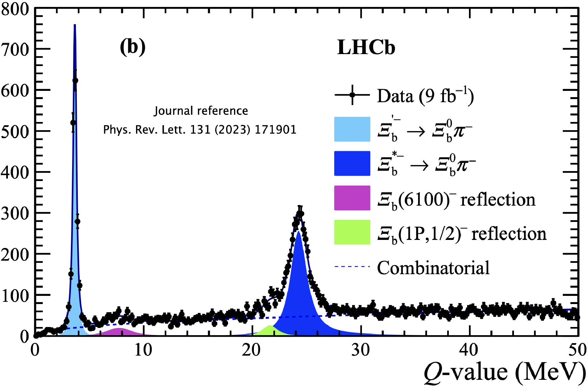

# Research Interests
Below are my key research interests, ranging from data analysis to software and hardware development for high-energy physics.

---

### Data Analysis - Spectroscopy of new states at LHCb
In recent years, I have led several analyses focused on searching for both conventional and exotic particle states.

read more...

My primary research has centered on heavy baryons, an area that was largely unexplored before the LHC era. Since then, the LHCb experiment has become a leader in this field, and my work has contributed to the discovery of numerous new states, sparking a growing area of investigation within the scientific community. These studies were conducted either independently or within small teams—an uncommon approach in large-scale collaborations. Additionally, my research has fostered strong connections between theoretical and experimental physics, helping to bridge the gap between the two communities.
A summary of the new resonances observed at the LHC can be found [[here]](https://www.nikhef.nl/~pkoppenb/particles.html). My contributions have directly led to the experimental observation of over 12 new states, among more than 70 discovered at the LHC in the past decade.

---

### Data Analysis - Central Exclusive Production (CEP)
I served as the convener of the Central Exclusive Production (CEP) group at LHCb, leading efforts to establish a new physics program within the experiment. Initially, CEP studies were considered unfeasible at LHCb, but the installation of the Herschel forward detector made them possible.

read more...

Herschel consisted of scintillator planes positioned in the LHC tunnel, approximately 200 meters from the interaction region. Its primary function was to extend the experiment’s angular coverage and provide veto capabilities to suppress background activity. My contributions encompassed both data analysis—where I played a key role in the first publications on this topic—and experimental work, including the detector’s installation, maintenance, calibration, and repair. I was specifically responsible for its calibration and operation, as well as the design of the hardware trigger that enabled CEP event collection. Additionally, I oversaw its seamless integration into LHCb’s software and hardware framework.
This project had proven to be particularly challenging due to the synergy between low-occupancy detector operations and the broader LHCb physics program. As a pioneering initiative, every aspect had to be developed from scratch, requiring close coordination with the collaboration’s management and operational teams at the experimental site.

---

### Data Analysis - CP violation and CKM matrix
I was the lead author of the first analysis on tree-level b → c transitions, which formed the core of my PhD research. This work led to the first experimental observation of the suppressed B → DK decay channel using the ADS/GLW method.

read more...
  
This final state is considered one of the golden channels for measuring the CKM matrix angle γ, a key physics objective for which the LHCb experiment was originally conceived. The tools I developed remain in use within LHCb, and the Probability Density Functions (PDFs) I designed to model partially reconstructed backgrounds—where a particle is lost in the decay chain—have been applied to asymmetry measurements in other channels involving neutral particles. Additionally, I contributed to the development of the frequentist fitter for the CKM angle γ, which continues to be a standard tool used by the collaboration today.

---

### The front-end circuits of the Upstream Tracker
The Milano group was involved in the development, construction, and characterization of front-end circuits of the Upstream Tracker. The Upstream Tracker (UT) is a silicon strip detector located before the magnetic dipole of LHCb. The detector consists of four planes, each approximately 1m², arranged in vertical staves made of sensors, each with an approximate silicon surface area of 10x10 cm, equipped with high-density strips.

read more...

The design is characterized by high detection efficiency, high strip density to manage the expected high occupancy in the detector, and a low radiation length to minimize multiple scattering. A circular cutout of the inner sensors was made to maximize the sensitive area around the beam pipe. At the Milano section, I was responsible for the entire production chain of the hybrid front-end circuits. This included the development, construction, and mechanical and electrical characterization of all the hybrid circuits currently installed on the new tracker.

The production program involved the fabrication and delivery of:
	- Over 1100 **VERA** hybrids with 4 chips (4400 detector-grade chips with fewer than 1000 non-functional channels), each with 128 channels.
	- Over 110 **SUSI** hybrids with 8 chips, featuring similar characteristics but with double the channel density to instrument the central part of the tracker where occupancy is highest.

The Milano team handled the following tasks:
- Glueing: We developed a system for bonding the chips with conductive glue. Given the high expected radiation flux, the glue was characterized by radiation tests. I was also responsible for irradiation campaigns to test the radiation hardness of the materials and adhesives used.
- Bonding: For all analog and digital channels.
- Burn-in: Each board was placed in a climatic chamber for 7 days at 60°C and powered according to a specific protocol to identify any early failures. These tests were conducted on all boards.
- Electrical testing: All channels were tested to evaluate the performance of the bonded chips, both before and after the high-temperature stress test.
- Optical inspection: Quality control of the bonding, including sample pull tests.
- Shipping: We developed a controlled environment storage and transportation system to ensure safe air delivery to colleagues in Syracuse University (US), who handled the subsequent stave construction.

All aspects of this work were designed in Milano, including the techniques and the development of all the necessary tools. In addition to the production activities, I also oversaw the reorganization of the clean room, the management of shifts and workflows, and the coordination with the industries involved in the construction of the bare flexes. The construction and delivery of the circuits were completed fully according to the planned timeline.

#### 6. Technical Design Report (TDR) e Simulazione

read more...

Ho partecipato alla scrittura del Technical Design Report (TDR) dell’Upstream Tracker per l’upgrade del tracciatore di LHCb.
Mi sono occupato delle prime simulazioni del detector nelle nuove condizioni sperimentali ad alto pile-up. Sono stato responsabile della caratterizzazione del ghost-rate e dell’efficienza di tracciamento per ottimizzare il design.
Accanto a tale attività di simulazione, ho coordinato il testing dei primi prototipi di silicio su fascio (al PS e SPS del CERN), con la caratterizzazione della loro performance, inclusa pubblicazione dei risultati su rivista specializzata (Testbeam studies of pre-prototype silicon strip sensors for the LHCb UT upgrade project NIM.A 806 (2016) 244-257).

#### 7. Online Monitoring dell’ Upstream Tracker (LHCb upgrade)

read more...

L’UT è stato l’ultimo subdetector ad essere installato durante il Run3. Attualmente in fase di commissioning,  esso prevede un intenso periodo di calibrazione e allineamento al resto del detector.
Il suo monitoring è stato individuato dal management dell’esperimento come uno di task cruciali per avere una presa dati di successo nell’anno prossimo
Sono responsabile della realizzazione di tutti i tool necessari per monitorare i dati del detector in real-time nella control room. E’ richiesta l’integrazione con il software esistente offline e lo sviluppo di opportuni decoder delle raw banks /histogrammer e hitmaps /  performance plot non ancora disponibili.

#### 8. Tracking 4D hardware: Progetto Timespot e relativi sviluppi

read more...

Per espandere le mie competenze in chiave di sviluppo di nuove tecnologie utili per lo sviluppo di esperimenti futuri, ho fatto parte del progetto Timespot (https://web.infn.it/timespot/), call di gruppo 5 finanziata dall’ INFN (1M euro totali). 
Il programma ha come obiettivo lo sviluppo di tecnologie per il tracking real time in 4D. Il progetto è terminato, ma ulteriori sviluppi sono tuttora in corso tramite altri progetti attivi nella sezione di Milano ed in altri dipartimenti (e.g. progetto ATTRACT).
Con l’aiuto di un postdoc e un ingegnere, si è realizzato un dimostratore per un sistema di tracciatura hardware codificato in FPGA che possa avere performance mai raggiunte prima a clock rates di 40MHz. L’idea è di applicare tali tecnologie a detector di nuova concezione (timescale 2025-2030), in cui la misura del timing risulta fondamentale per poter funzionare ai rate di raccolta dati previsti nei detector di nuova generazione attualmente in fase di concept-design (tempo di arrivo delle particelle su ciascun piano sensibile di 30ps in pixel di dimensioni trasverse di 50um).

#### 9. Progetto EDIPO: Experiment for DIPOle moments of short-lived heavy fermions at LHC

read more...

  - I am a founding member of the ALADDIN collaboration (established in 2024).

Il progetto EDIPO si inserisce nella ricerca di nuove possibilità per la realizzazioni di nuovi esperimenti sull’acceleratore LHC (generalmente di dimensioni ridotte se comparati ai General Purpose Detector). Il progetto EDIPO prevede la realizzazione di un dimostratore per un nuovo esperimento a targhetta fissa ad LHC. L’idea è di effettuare un test proof-of-principle da testare su fascio al SPS.
Si propone la misura diretta dei momenti di dipolo elettrico e magnetico di fermioni pesanti short-lived (charm and beauty baryons e il leptone τ). Queste misure sono sensibili a fisica sia del Modello Standard che oltre (BSM) e sono basate sulla precessione dello spin di particelle polarizzate in campi elettromagnetici estremamente intensi. La precessione viene realizzata tramite “channeling” delle particelle in cristalli curvi posti accanto al fascio principale.
Uno studio di fattibilità è in considerazione presso il gruppo di acceleratori al CERN ed è stata individuata una sezione dritta della macchina per questo nuovo esperimento alla Insertion Region 3 (IR3), una sezione attualmente dedicata alla pulizia dei fasci di LHC. Tale misure risultano complementari ad altre misure di precisione del Modello Standard (e.g. g-2).
Il progetto EDIPO si prefigge di sviluppare simulazioni dettagliate dell’esperimento, l’ottimizzazione dei diversi layout e la valutazione delle possibili tecnologie impiegabili. Una stazione + sensore dell’attuale rivelatore di vertice di LHCb (VELO - silicon pixel detector) sarà caratterizzata ed adattata per contenere i costi di produzione sia dei sensori che del loro readout.
Si prevede il design e la costruzione dell’hardware richiesto per includere tale sensore in una “Roman Pot”, come primo prototipo di stazione per il detector finale. Le Roman Pot saranno ispirate a quelle utilizzate per l’esperimento TOTEM al CERN.
Si pensa di espandere il progetto includendo studi di fattibilità di fotoproduzione di stati esotici come pentaquark. Per tale attività si ricorrerà all’esperienza sviluppata nell’ambito delle analisi di CEP.

