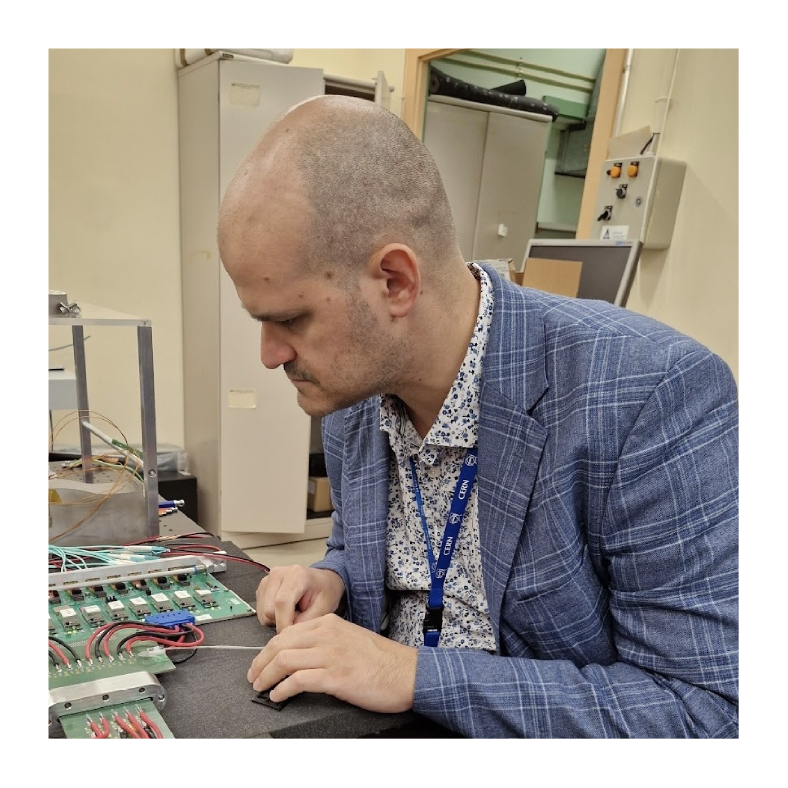

# Paolo Gandini
{{ page.subtitle }}
I am a staff researcher at Istituto Nazionale Fisica Nucleare (INFN).
Experimental particle physicst working at the LHCb experiment at CERN since 2009.
I am active on data analysis and my main interests are heavy baryon spectroscopy and CP violation in the b sector.
I have also activities on hardware development and R&D of new silicon detectors.
Proponent of the new ALADDIN experiment at CERN.
