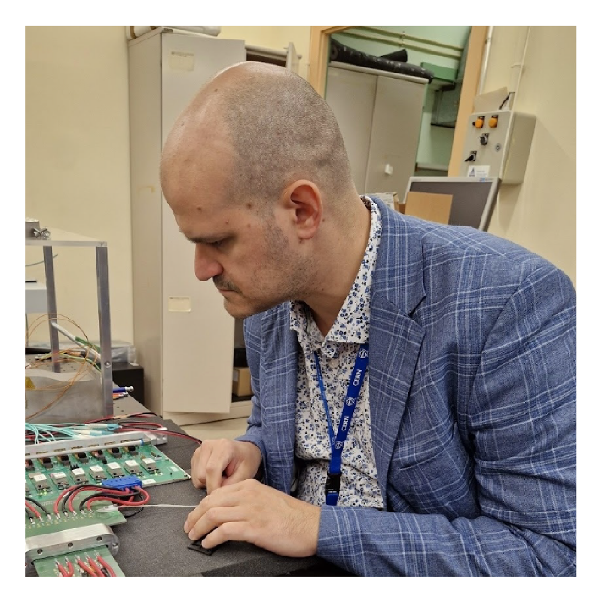

# Paolo Gandini

**Primo Ricercatore INFN**

I am a staff researcher at the Istituto Nazionale di Fisica Nucleare (INFN) and an experimental particle physicist working on the LHCb experiment at CERN since 2009. Currently, I serve as the Deputy Principal Investigator of the LHCb Milano group.
My research focuses on data analysis, with a particular interest in heavy baryon spectroscopy and CP violation in the b-quark sector. In addition to data analysis, I am actively involved in hardware development and R&D for next-generation silicon detectors.
I am also a proponent of the ALADDIN experiment, a new proposed experiment at LHC.

Feel free to explore my work and reach out for collaborations or discussions!

OrcidID: [0000-0001-7267-6008](https://orcid.org/0000-0001-7267-6008)
